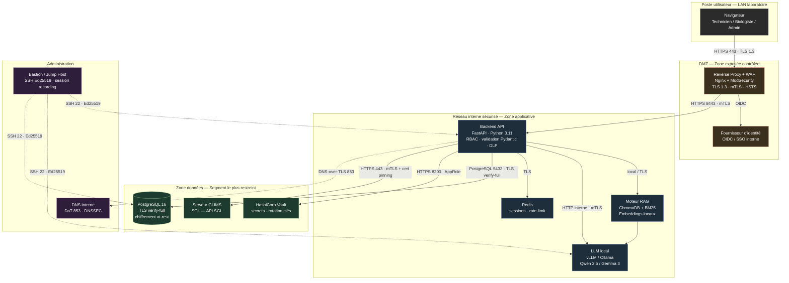
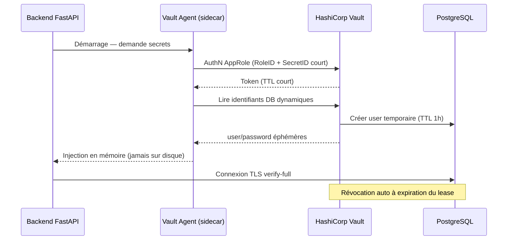

# Architecture Technique & Sécurité — MISPL Agent

**Dossier DSI — Document de Conception Architecturale (DCA)**

| | |
|---|---|
| **Application** | MISPL Agent — Assistant IA de génération de code MISPL pour GLIMS |
| **Classification** | Outil métier interne — données sensibles (code SGL, contexte laboratoire) |
| **Exigence directrice** | **Zero Trust** — aucune connexion en clair tolérée, chiffrement bout-en-bout |
| **Hébergement cible** | 100 % interne (on-premise), LLM local, aucune dépendance Cloud |
| **Version document** | 1.0 |
| **Auteur** | Architecture Logicielle & Cybersécurité |
| **Statut** | Pour validation DSI |

---

## 0. Synthèse exécutive (TL;DR pour la DSI)

MISPL Agent est un assistant à base de RAG (Retrieval-Augmented Generation) qui aide les techniciens et biologistes à écrire du code **MISPL** (langage de scripting du SGL **GLIMS**). L'application ne contient **aucune donnée patient** : elle manipule de la documentation technique et du code. Un filtre **DLP** (Data Loss Prevention) déjà implémenté bloque toute saisie accidentelle de données de santé à caractère personnel (NIR, IPP, NISS).

Le présent document décrit une cible **entièrement internalisée** :

- **LLM local** (Gemma 3 ou Qwen 2.5) — aucun appel à un Cloud externe (OpenRouter/OpenAI supprimé en production).
- **Embeddings locaux** (`sentence-transformers`) — déjà offline.
- **Zero Trust réseau** — TLS 1.3 partout, mTLS pour les flux machine-à-machine, SSH par clés Ed25519 via bastion.
- **Secrets** centralisés dans **HashiCorp Vault** — zéro secret dans le code.
- **RBAC** à 4 rôles aligné sur l'organisation d'un laboratoire de biologie médicale.

---

## 1. Cartographie des flux réseaux

### 1.1 Principe Zero Trust appliqué

> **Postulat** : aucun réseau n'est de confiance, y compris le LAN interne. Chaque flux est authentifié, chiffré et autorisé explicitement. Le périmètre n'est pas une frontière mais un ensemble de micro-segments.

Trois zones de sécurité :

- **Zone DMZ** — exposition contrôlée (reverse proxy uniquement).
- **Zone applicative interne** — backend, LLM, vectorstore (segment réseau dédié, non routable depuis le poste utilisateur).
- **Zone données / SGL** — serveur GLIMS et base de données (segment le plus restreint, accès par allow-list).

### 1.2 Flux entrants (Ingress)

| # | Source | Destination | Port | Protocole | Authentification | Chiffrement |
|---|--------|-------------|------|-----------|------------------|-------------|
| I1 | Poste utilisateur (LAN) | Reverse Proxy (DMZ) | 443 | HTTPS | Session SSO / OIDC | TLS 1.3 |
| I2 | Reverse Proxy | Backend applicatif | 8443 | HTTPS (mTLS) | Certificat client | TLS 1.3 + mTLS |
| I3 | Admin (bastion) | Hôtes infra | 22 | SSH | Clé Ed25519 | SSH-2 (chacha20-poly1305) |

### 1.3 Flux sortants (Egress)

| # | Source | Destination | Port | Protocole | Authentification | Chiffrement |
|---|--------|-------------|------|-----------|------------------|-------------|
| E1 | Backend | Serveur GLIMS (API SGL) | 443 | HTTPS (mTLS) | Certificat client + token | TLS 1.3 + mTLS |
| E2 | Backend | Moteur LLM local (Ollama/vLLM) | 11434 / 8000 | HTTP interne | mTLS ou socket Unix | TLS 1.3 (intra-segment) |
| E3 | Backend | Vectorstore ChromaDB | local / 8001 | gRPC/HTTP | Token interne | TLS 1.3 ou IPC local |
| E4 | Backend | PostgreSQL | 5432 | PostgreSQL | Certificat client `sslmode=verify-full` | TLS 1.3 |
| E5 | Backend / Hôtes | HashiCorp Vault | 8200 | HTTPS | AppRole / token court | TLS 1.3 |
| E6 | Tous hôtes | Serveur DNS interne | 853 | DNS-over-TLS (DoT) | — | TLS 1.3 |

> **Règle egress** : tout flux sortant vers Internet est **bloqué par défaut**. Aucune route vers un Cloud LLM en production. La seule exception contrôlée est le miroir interne de paquets (PyPI proxy interne / dépôt apt local).

### 1.4 Implémentation HTTPS / TLS 1.3

**Reverse proxy (Nginx ou Caddy)** en terminaison TLS :

- **Version** : TLS 1.3 uniquement (TLS 1.2 toléré en repli interne si un composant legacy l'impose, jamais en dessous).
- **Suites cryptographiques** : `TLS_AES_256_GCM_SHA384`, `TLS_CHACHA20_POLY1305_SHA256`. Désactivation de tout chiffrement RSA statique, 3DES, CBC.
- **Échange de clés** : ECDHE (X25519) — Perfect Forward Secrecy garanti.
- **Certificats** :
  - Émis par une **PKI interne** (AC d'entreprise) ou ACME interne (step-ca / Smallstep).
  - Algorithme **ECDSA P-256** (ou RSA-3072 si compatibilité requise).
  - **Durée courte** (90 jours) + renouvellement automatique (ACME) → réduit la fenêtre de compromission.
- **HSTS** : `Strict-Transport-Security: max-age=63072000; includeSubDomains; preload`.
- **OCSP Stapling** activé.
- **mTLS** (mutual TLS) sur les flux machine-à-machine (I2, E1, E4) : le client présente aussi un certificat → authentification bidirectionnelle.

**Exemple de configuration Nginx (extrait durci)** :

```nginx
server {
    listen 443 ssl;
    http2 on;
    server_name mispl-agent.interne.chu;

    ssl_protocols          TLSv1.3;
    ssl_ciphers            TLS_AES_256_GCM_SHA384:TLS_CHACHA20_POLY1305_SHA256;
    ssl_prefer_server_ciphers off;
    ssl_ecdh_curve         X25519:secp384r1;

    ssl_certificate        /etc/ssl/mispl/server.crt;
    ssl_certificate_key    /etc/ssl/mispl/server.key;   # référence Vault, jamais en clair sur disque

    ssl_stapling           on;
    ssl_stapling_verify    on;

    add_header Strict-Transport-Security "max-age=63072000; includeSubDomains; preload" always;
    add_header X-Content-Type-Options    "nosniff" always;
    add_header X-Frame-Options           "DENY" always;
    add_header Content-Security-Policy    "default-src 'self'; frame-ancestors 'none'" always;
    add_header Referrer-Policy            "no-referrer" always;
    add_header Permissions-Policy         "geolocation=(), microphone=(), camera=()" always;

    # mTLS vers le backend
    location / {
        proxy_pass                 https://backend_mispl:8443;
        proxy_ssl_certificate      /etc/ssl/mispl/proxy-client.crt;
        proxy_ssl_certificate_key  /etc/ssl/mispl/proxy-client.key;
        proxy_ssl_verify           on;
        proxy_ssl_protocols        TLSv1.3;
    }
}
```

### 1.5 Administration par SSH durci

Tout accès d'administration passe par un **bastion (jump host)** unique et journalisé. Aucun accès SSH direct aux hôtes applicatifs.

**Politique SSH (`/etc/ssh/sshd_config`)** :

```sshd
# Authentification par clé asymétrique uniquement
PasswordAuthentication        no
ChallengeResponseAuthentication no
KbdInteractiveAuthentication  no
PubkeyAuthentication          yes

# Algorithmes de clé : Ed25519 (courbe Edwards, rapide, résistant)
PubkeyAcceptedAlgorithms      ssh-ed25519,sk-ssh-ed25519@openssh.com
HostKeyAlgorithms             ssh-ed25519

# Interdiction stricte du compte root
PermitRootLogin               no

# Chiffrement / MAC / KEX durcis
KexAlgorithms                 curve25519-sha256,curve25519-sha256@libssh.org
Ciphers                       chacha20-poly1305@openssh.com,aes256-gcm@openssh.com
MACs                          hmac-sha2-512-etm@openssh.com,hmac-sha2-256-etm@openssh.com

# Surface réduite
AllowAgentForwarding          no
X11Forwarding                 no
MaxAuthTries                  3
LoginGraceTime                20
ClientAliveInterval           300
ClientAliveCountMax           2

# Accès limité aux groupes admin + via bastion
AllowGroups                   mispl-admins
```

**Mesures complémentaires** :

- Clés **Ed25519** générées par admin (`ssh-keygen -t ed25519 -a 100`), passphrase obligatoire, idéalement sur **token matériel** (YubiKey, `sk-ssh-ed25519`).
- **Certificats SSH** signés par une CA SSH interne (durée 8 h) plutôt que clés permanentes → révocation immédiate, rotation automatique.
- Bastion : enregistrement de session (audit `auditd` + journalisation `session recording`).
- Administration par compte nominatif + `sudo` granulaire ; root verrouillé (`!` dans `/etc/shadow`).

### 1.6 Résolution DNS sécurisée vers GLIMS

L'application doit **cibler, authentifier et joindre** le serveur GLIMS de façon fiable.

- **DNS interne autoritaire** : le nom `glims.interne.chu` est résolu uniquement par le DNS interne (jamais de DNS public).
- **DNS-over-TLS (DoT, port 853)** : toutes les requêtes DNS des hôtes sont chiffrées vers le résolveur interne → pas d'empoisonnement de cache en clair.
- **DNSSEC** activé sur la zone interne → intégrité et authenticité des réponses (anti-spoofing).
- **Pinning du certificat GLIMS** : le backend valide le certificat serveur de GLIMS contre l'AC interne **et** un hash épinglé (`SPKI pin`) → un MITM avec un certificat valide mais non attendu est rejeté.
- **Fichier `hosts` de secours** non utilisé en prod (anti-dérive) ; la résolution passe par la chaîne DNS contrôlée.
- **mTLS applicatif** vers GLIMS (flux E1) : double preuve d'identité (réseau + certificat client).

---

## 2. Stack technique & schémas

### 2.1 Stack retenue

| Couche | Technologie | Justification |
|--------|-------------|---------------|
| **Frontend** | Streamlit (durci) ou migration React + FastAPI | Streamlit = existant, rapide à livrer ; React/FastAPI = cible si besoin d'auth fine, CSP stricte et SPA. UI épurée, dark mode natif. |
| **Backend / API** | **Python 3.11 + FastAPI** | Asynchrone (ASGI), typage Pydantic, validation d'entrée native, performant, écosystème data/IA mature. Remplace l'orchestration Streamlit monolithique en production. |
| **Moteur RAG** | ChromaDB + rank-bm25 + sentence-transformers | Recherche hybride dense + BM25 (déjà en place). **Embeddings 100 % locaux** (`paraphrase-multilingual-MiniLM-L12-v2`) → aucune fuite vers un Cloud. |
| **LLM** | **Local** : Ollama ou vLLM servant **Gemma 3** / **Qwen 2.5** | Souveraineté des données, pas d'appel externe, coût marginal nul, conformité RGPD/HDS facilitée. |
| **Base de données** | **PostgreSQL 16** (TLS, chiffrement at-rest) | ACID, robuste, `sslmode=verify-full`, chiffrement disque (LUKS/TDE), audit natif. Stocke utilisateurs, rôles, logs d'audit, historique des scripts générés. |
| **Cache / sessions** | Redis (TLS, auth) | Sessions, rate-limiting, file de tâches LLM. |
| **Secrets** | **HashiCorp Vault** | Centralisation, rotation automatique, audit, location-based access (AppRole). |
| **Reverse proxy / WAF** | Nginx + ModSecurity (OWASP CRS) ou Caddy | Terminaison TLS 1.3, mTLS, headers de sécurité, pare-feu applicatif. |
| **Conteneurisation** | Docker + orchestration (Podman/Kubernetes interne) | Isolation, reproductibilité, rootless containers, NetworkPolicies. |
| **Observabilité** | Loki + Prometheus + Grafana (interne) | Logs centralisés, métriques, alerting sécurité. |

**Justification synthétique par critère** :

- **Performance** : FastAPI async + vLLM (batching/PagedAttention) tient la charge multi-utilisateurs ; ChromaDB + BM25 = retrieval < 100 ms.
- **Sécurité** : tout local, TLS partout, Vault, WAF, RBAC, DLP. Surface d'attaque externe quasi nulle (pas d'egress Internet).
- **Maintenabilité** : Python homogène, typage strict, conteneurs versionnés, IaC (Terraform/Ansible), tests `pytest` existants.

### 2.2 Dimensionnement infrastructure du LLM local

Choix du modèle selon le matériel disponible. Cibles recommandées : **Gemma 3** et **Qwen 2.5** (excellents en code et multilingue FR).

| Modèle | Quantisation | VRAM requise | RAM système | GPU recommandé | Débit indicatif | Usage cible |
|--------|--------------|--------------|-------------|----------------|------------------|-------------|
| **Qwen 2.5 7B Instruct** | Q4_K_M (GGUF) | ~6 Go | 16 Go | RTX 4060 Ti 16 Go / L4 | 40–60 tok/s | Labo mono-site, charge modérée |
| **Gemma 3 12B** | Q4_K_M | ~9–10 Go | 32 Go | RTX 4070 Ti / A4000 | 25–40 tok/s | Qualité supérieure, 1–10 users |
| **Qwen 2.5 14B Instruct** | Q4_K_M | ~11 Go | 32 Go | RTX 4080 / A5000 | 25–35 tok/s | Bon compromis qualité/coût |
| **Qwen 2.5 32B Instruct** | Q4_K_M | ~20–22 Go | 64 Go | RTX 4090 24 Go / A6000 | 15–25 tok/s | Qualité élevée, multi-users |
| **Qwen 2.5 32B / Gemma 3 27B** | FP16 (vLLM) | 2× A100 40 Go ou 1× H100 80 Go | 128 Go | A100/H100 | 60–120 tok/s (batché) | Production multi-sites, haute dispo |

**Recommandations de déploiement** :

- **Démarrage / pilote** : **Qwen 2.5 14B Q4** sur 1 GPU 16–24 Go (Ollama). Coût matériel maîtrisé, qualité de code MISPL satisfaisante avec le RAG.
- **Production** : **vLLM** (et non Ollama) pour le batching multi-requêtes, servant **Qwen 2.5 32B** ou **Gemma 3 27B** en FP16/AWQ sur GPU datacenter (A100/L40S).
- **CPU-only** (repli sans GPU) : Qwen 2.5 7B Q4 via `llama.cpp` — fonctionnel mais lent (5–10 tok/s), réservé à une démo.
- **Stockage modèles** : 5–25 Go par modèle (GGUF quantisé) ; prévoir 200 Go SSD NVMe pour modèles + vectorstore + logs.
- **Haute disponibilité** : 2 nœuds GPU derrière un load-balancer interne (round-robin), modèle répliqué.

### 2.3 Schéma d'architecture (Mermaid.js)



---

## 3. Gestion des identités et des rôles (RBAC)

### 3.1 Authentification

- **SSO/OIDC** adossé à l'annuaire d'entreprise (LDAP/AD ou Keycloak interne).
- **MFA obligatoire** pour les rôles Biologiste et Administrateur.
- Sessions à **durée limitée** (token JWT court + refresh), révocables côté serveur (liste de révocation Redis).
- Aucune authentification locale par mot de passe en production hors compte de secours (break-glass, scellé).

### 3.2 Profils utilisateurs

| Rôle | Description métier |
|------|--------------------|
| **Technicien de laboratoire** | Génère et teste des scripts MISPL courants (calculs, formatage). Usage quotidien, périmètre encadré. |
| **Biologiste médical** | Valide les scripts, accède aux cas avancés (reflex testing, non-conformités), supervise la qualité. |
| **Administrateur métier (référent MISPL)** | Gère la base de connaissances RAG, les paramètres métier, les modèles de prompt. |
| **Administrateur système** | Exploite l'infrastructure (serveurs, LLM, Vault, réseau). N'accède pas au contenu métier sauf maintenance tracée. |

### 3.3 Matrice des permissions

| Capacité | Technicien | Biologiste | Admin métier | Admin système |
|----------|:---------:|:----------:|:------------:|:-------------:|
| Générer un script MISPL (RAG + LLM) | ✅ | ✅ | ✅ | ⛔ |
| Consulter l'historique de ses scripts | ✅ | ✅ | ✅ | ⛔ |
| Consulter l'historique de **tous** les scripts | ⛔ | ✅ | ✅ | ⛔ |
| Valider / approuver un script | ⛔ | ✅ | ✅ | ⛔ |
| **Déployer** un script vers GLIMS (flux E1) | ⛔ | ✅ (avec double validation) | ⛔ | ⛔ |
| Lecture documentation / base RAG | ✅ | ✅ | ✅ | ⛔ |
| **Écriture / mise à jour** base RAG (KB) | ⛔ | ⛔ | ✅ | ⛔ |
| Configuration métier (seuils, prompts, modèles) | ⛔ | ⛔ | ✅ | ⛔ |
| Gestion des rôles / utilisateurs | ⛔ | ⛔ | ⛔ (délégué IDP) | ✅ |
| Administration infra (SSH, Vault, LLM, DB) | ⛔ | ⛔ | ⛔ | ✅ |
| Accès aux logs d'audit de sécurité | ⛔ | ⛔ | Lecture partielle | ✅ |

**Principes** :

- **Moindre privilège** : un rôle n'a que les droits strictement nécessaires.
- **Séparation des pouvoirs** : l'admin système n'a **pas** accès au contenu métier ; l'admin métier n'a **pas** accès à l'infra. Le déploiement vers GLIMS exige une double validation (4-eyes).
- **Interactions GLIMS** : seules les actions de **lecture** (consultation de schéma, validation syntaxique) sont ouvertes largement ; toute **écriture** vers le SGL est restreinte au Biologiste avec validation, et journalisée.

---

## 4. Stockage des secrets et mots de passe

### 4.1 Mots de passe utilisateurs

> En cible, l'authentification est déléguée à l'**IDP/SSO** : l'application ne stocke idéalement **aucun** mot de passe. Pour les comptes locaux résiduels (break-glass) :

- **Hachage Argon2id** (recommandation OWASP / ANSSI), paramètres : `memory ≥ 19 MiB`, `iterations ≥ 2`, `parallelism = 1`, ajustés au matériel.
- **Sel unique** aléatoire (≥ 16 octets) par utilisateur, généré par CSPRNG.
- **Poivre (pepper)** optionnel stocké dans Vault, jamais en base.
- Bcrypt (coût ≥ 12) accepté en repli si Argon2id indisponible.
- **Jamais** de stockage en clair, MD5, SHA1 ou SHA-256 nu.

```python
from argon2 import PasswordHasher

# Paramètres durcis (OWASP) — sel généré automatiquement, unique par hash
ph = PasswordHasher(time_cost=3, memory_cost=65536, parallelism=2)

def hash_password(plain: str) -> str:
    return ph.hash(plain)  # contient sel + paramètres, stockable tel quel

def verify_password(stored_hash: str, plain: str) -> bool:
    try:
        return ph.verify(stored_hash, plain)
    except Exception:
        return False
```

### 4.2 Secrets applicatifs (clés API, identifiants DB, certificats)

**Aucun secret dans le code source ni dans une image Docker.** Constat actuel : `.env.example` documente déjà la séparation des secrets — en production, on remplace `.env` par Vault.

- **HashiCorp Vault** comme source unique de vérité :
  - **AppRole** : le backend s'authentifie avec un RoleID + SecretID à durée courte, injecté au démarrage (Vault Agent / sidecar).
  - **Secrets dynamiques** : identifiants PostgreSQL générés à la volée, à TTL court, révoqués automatiquement.
  - **Rotation automatique** des clés et certificats (lease + renew).
  - **Audit** : chaque lecture de secret est journalisée.
- **Variables d'environnement strictes** (repli sans Vault) : injectées par l'orchestrateur (Docker secrets / Kubernetes Secrets chiffrés au repos), jamais commitées, `.env` dans `.gitignore`.
- **Certificats** : clés privées stockées dans Vault (moteur PKI), jamais en clair sur disque ; le reverse proxy les récupère via Vault Agent.
- **Scan anti-fuite** : pré-commit `gitleaks` / `trufflehog` dans la CI pour bloquer tout secret accidentellement committé.



---

## 5. Sécurisation end-to-end

### 5.1 Preuve de couverture — 100 % chiffré

**En transit** — chaque flux du tableau §1.2/§1.3 est chiffré :

| Flux | Chiffrement | Statut |
|------|-------------|:------:|
| Utilisateur → Proxy (I1) | TLS 1.3 | ✅ |
| Proxy → Backend (I2) | TLS 1.3 + mTLS | ✅ |
| Backend → GLIMS (E1) | TLS 1.3 + mTLS + cert pinning | ✅ |
| Backend → LLM local (E2) | TLS 1.3 / socket Unix | ✅ |
| Backend → ChromaDB (E3) | TLS / IPC local | ✅ |
| Backend → PostgreSQL (E4) | TLS 1.3 verify-full | ✅ |
| Backend → Vault (E5) | TLS 1.3 | ✅ |
| Tous → DNS (E6) | DNS-over-TLS | ✅ |
| Admin → Infra (I3) | SSH-2 Ed25519 | ✅ |

→ **Aucune connexion en clair.** Egress Internet bloqué par défaut.

**Au repos** :

- **Base PostgreSQL** : chiffrement disque (LUKS au niveau OS, ou TDE) + colonnes sensibles chiffrées applicativement.
- **Vectorstore / modèles LLM** : volume chiffré (LUKS).
- **Sauvegardes** : chiffrées (GPG / restic avec clé Vault), stockage interne.
- **Mots de passe** : Argon2id (cf. §4.1).
- **Logs d'audit** : intègres (chaînage / signature) et chiffrés au repos.

### 5.2 Mécanismes de contrôle

**Headers de sécurité stricts** (appliqués au reverse proxy, cf. §1.4) :

- `Strict-Transport-Security` (HSTS preload)
- `Content-Security-Policy: default-src 'self'; frame-ancestors 'none'`
- `X-Content-Type-Options: nosniff`
- `X-Frame-Options: DENY`
- `Referrer-Policy: no-referrer`
- `Permissions-Policy` restrictive

**Pare-feu applicatif (WAF)** :

- ModSecurity + **OWASP Core Rule Set** (anti-injection SQL, XSS, path traversal).
- **Rate-limiting** par utilisateur et par IP (Redis) → anti-bruteforce / anti-abus LLM.
- Validation stricte des entrées (Pydantic) côté backend.

**DLP (déjà implémenté)** — filtre anti-fuite de données de santé : blocage des saisies contenant NIR, IPP/NIP, NISS, dates de naissance nominatives avant tout envoi au LLM. À conserver et renforcer en production.

**Rotation automatique des clés** :

- Certificats TLS : ACME 90 jours, renouvellement auto.
- Certificats SSH : CA SSH, durée 8 h.
- Identifiants DB : secrets dynamiques Vault, TTL 1 h.
- Clés de signature JWT : rotation périodique avec recouvrement (JWKS).

**Segmentation & micro-périmètres** :

- NetworkPolicies / pare-feu inter-segments : seuls les flux explicitement autorisés (§1) passent ; tout le reste est refusé (default deny).
- Conteneurs **rootless**, capacités Linux minimales, systèmes de fichiers en lecture seule.

**Détection & réponse** :

- Centralisation des logs (Loki), corrélation (alerting Grafana/Prometheus).
- Journalisation immuable des accès secrets (Vault audit), des sessions SSH (bastion), des déploiements GLIMS.
- Sauvegardes testées + plan de reprise.

---

## 6. Conformité & points d'attention DSI

- **Souveraineté / RGPD-HDS** : LLM et embeddings 100 % locaux → aucune donnée ne quitte le SI. Argument fort pour l'hébergement de données de santé.
- **Aucune donnée patient stockée** par l'application ; le DLP est le filet de sécurité contre la saisie accidentelle.
- **Dette de production à traiter** : retirer la dépendance OpenRouter/OpenAI (présente en dev) au profit du LLM local — **bloquant** pour la mise en production Zero Trust.
- **PKI interne** requise (AC d'entreprise) pour mTLS et certificats courts — pré-requis infra à valider avec la DSI.
- **Pré-requis matériel GPU** (cf. §2.2) à arbitrer selon le budget et le niveau de qualité visé.

---

*Document soumis à validation DSI. Toute mise en production est conditionnée à la suppression des appels LLM externes et au déploiement de la PKI interne et de HashiCorp Vault.*
