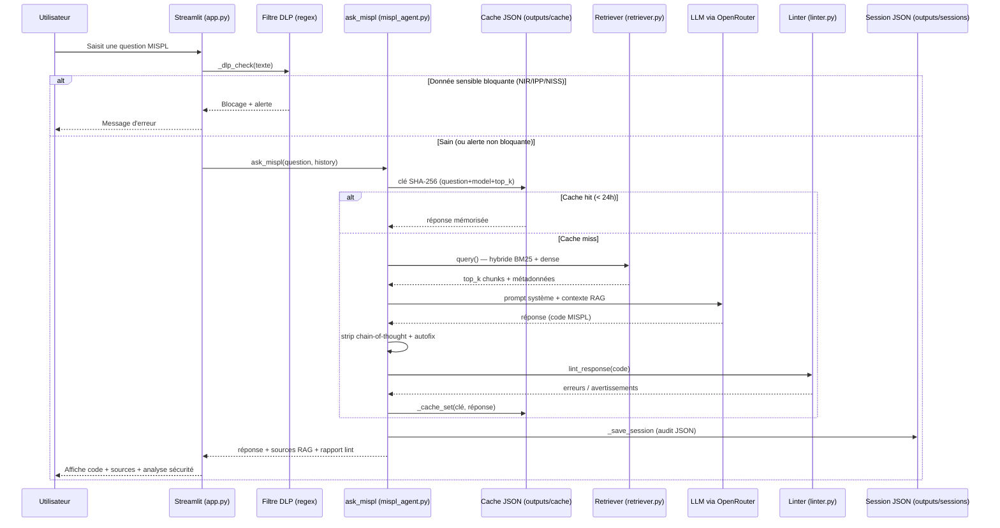
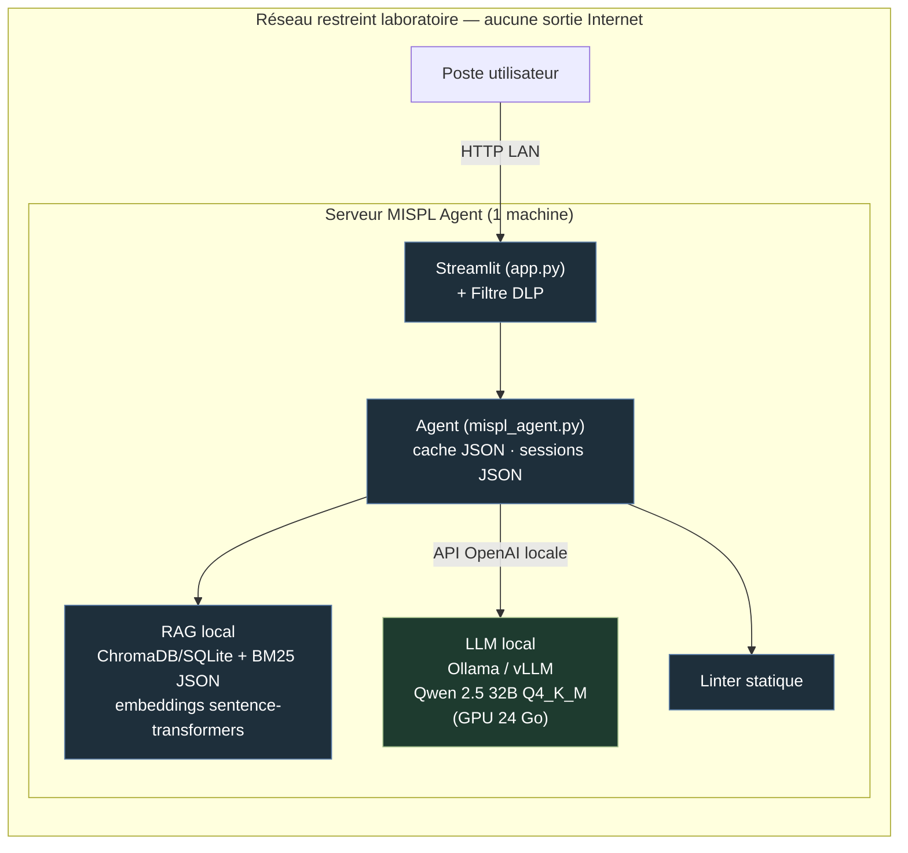

# Architecture Technique & Sécurité — MISPL Agent

**Dossier DSI — Document de Conception Architecturale (DCA)**

| Métadonnée | Valeur |
|---|---|
| **Application** | MISPL Agent — Assistant IA de génération de code MISPL pour GLIMS |
| **Classification** | Outil métier interne — manipule du code et de la documentation technique (aucune donnée patient) |
| **Exigence directrice** | Zero Trust — souveraineté des données, surface d'attaque minimale |
| **Hébergement cible** | 100 % interne (on-premise) — réseau restreint du laboratoire |
| **Statut actuel** | Pilote fonctionnel. Une seule dépendance externe à remédier (LLM Cloud) |
| **Version document** | 3.0 — réécriture alignée sur le code source réel |
| **Auteur** | Florian MAGNE |
| **Date révision** | 2026-06-15 |
| **Statut** | Pour validation DSI |

> **Note méthodologique** : ce document décrit **exclusivement l'architecture réellement implémentée** dans le dépôt (`app.py`, `src/agent/`, `src/rag/`). Toute infrastructure idéalisée non présente dans le code (Vault, PostgreSQL, React, SSO/OIDC, Kubernetes, mTLS inter-services) a été volontairement écartée. La force de cette application est sa **légèreté** : peu de composants, peu de dépendances, déploiement trivial.

---

## 0. Synthèse exécutive

MISPL Agent est un assistant à base de **RAG (Retrieval-Augmented Generation)** qui aide techniciens et biologistes à écrire du code **MISPL** (langage de scripting propriétaire du SIL **GLIMS**).

**Caractéristiques réelles de l'architecture** :

1. **Application légère et autonome** — une interface **Streamlit** unique (`app.py`), un moteur RAG local, un linter statique. Aucune base de données serveur, aucun orchestrateur lourd.
2. **Stockage 100 % fichiers plats** — sessions d'audit en JSON (`outputs/sessions/`), cache en JSON (`outputs/cache/`), index vectoriel en SQLite local (ChromaDB). Pas de SGBD à administrer.
3. **Embeddings locaux** — `sentence-transformers`, modèle `paraphrase-multilingual-MiniLM-L12-v2`, exécuté hors-ligne sur CPU. Aucune fuite côté vectorisation.
4. **Filtre DLP intégré** — regex exécutées dans `app.py` **avant tout traitement**, bloquant NIR / IPP / NISS / dates nominatives.
5. **Une seule faille réelle** — l'inférence LLM passe aujourd'hui par l'API Cloud **OpenRouter** (`OPENROUTER_BASE_URL`). C'est le **seul** point qui rompt le Zero Trust.
6. **Remédiation triviale** — basculer en 100 % souverain ne demande **aucune réécriture** : il suffit de pointer `OPENROUTER_BASE_URL` vers un serveur local (Ollama / vLLM) compatible avec le SDK OpenAI.

---

## 1. Vue d'ensemble du pipeline réel



---

## 2. Frontend & interface

### 2.1 Streamlit — Single Page Application

L'interface est une **application monopage robuste développée en Streamlit** (`app.py`), exécutée côté serveur. Elle n'utilise ni framework JavaScript, ni build frontend : l'ensemble du rendu est généré par Streamlit.

| Aspect | Implémentation réelle |
|--------|------------------------|
| **Moteur d'UI** | Streamlit (`st.set_page_config`, `st.markdown`, `st.session_state`) |
| **Thème** | Sombre natif + **injection de CSS personnalisé** (`st.markdown("""<style>…</style>""", unsafe_allow_html=True)`) pour les bulles de message, pastilles d'état, mise en page |
| **État de session** | `st.session_state` (messages, sources RAG, contexte labo) — état **en mémoire** par session navigateur, non persisté en base |
| **Historique conversationnel** | Les 12 derniers messages de `st.session_state.messages` sont transmis à l'agent ; l'agent n'en injecte que les 6 derniers dans le prompt (maîtrise de la fenêtre de contexte) |
| **Chargement du moteur** | `@st.cache_resource` — le retriever et l'agent sont chargés **une seule fois** (singleton), pas à chaque interaction |
| **Saisie de la clé API** | Champ `st.text_input` (type password) ou lecture de la variable d'environnement `OPENROUTER_API_KEY` |

### 2.2 Filtre DLP — première barrière

Le filtre **DLP** (`_dlp_check()` dans `app.py`) s'exécute sur chaque saisie **avant tout appel à l'agent ou au LLM**. Il repose sur une liste de patterns regex, chacun marqué bloquant ou non :

| Donnée détectée | Comportement | Justification |
|-----------------|--------------|---------------|
| **NIR / Numéro Sécu** | **Bloquant** — rejet immédiat | Identifiant patient niveau 1 (DCPS) |
| **NISS belge** | **Bloquant** | Équivalent belge |
| **IPP / NIP patient** | **Bloquant** | Identifiant site patient |
| **Date de naissance nominative** (« né le … ») | Alerte non bloquante | Potentiellement nominatif |
| **Date `JJ/MM/AAAA` isolée** | Alerte non bloquante | Peut être une date de naissance |
| **Nom patient potentiel** (`M./Mme/Dr Prénom NOM`) | Alerte non bloquante | Patronyme nominatif |

> Le DLP est un **filet de sécurité** contre une saisie accidentelle de données de santé. L'application ne stocke aucune donnée patient ; le DLP empêche qu'une telle donnée transite vers le LLM.

---

## 3. Persistance & stockage — architecture « zéro SQL »

L'application est **stateless vis-à-vis de toute base de données serveur**. Il n'y a **ni PostgreSQL, ni MySQL, ni serveur de base de données** à installer, sécuriser ou sauvegarder. Toute la persistance repose sur des **fichiers plats locaux**, ce qui simplifie radicalement le déploiement en réseau restreint.

| Donnée persistée | Support réel | Emplacement | Détails |
|------------------|--------------|-------------|---------|
| **Audit / historique** | Fichiers **JSON** plats | `outputs/sessions/session_<timestamp>.json` | Une session = un échange complet : question, sources RAG (avec scores), résultat du lint (erreurs/avertissements), réponse, modèle utilisé, skills actifs. Écrit par `_save_session()`. |
| **Cache applicatif** | Fichiers **JSON** plats | `outputs/cache/<sha256_16>.json` | Clé = `SHA-256(CACHE_VERSION + question + model + top_k)` tronquée à 16 caractères. **TTL 24 h** (`age > 86400` → suppression). Invalidation globale par incrément de `CACHE_VERSION` (actuellement `v23`). |
| **Index vectoriel (RAG dense)** | **ChromaDB sur SQLite local** | `docs/chunks/vectorstore/chroma.sqlite3` (+ segments HNSW) | `chromadb.PersistentClient` — base **embarquée**, pas un serveur. Collection `glims_mispl_docs`, espace cosinus. |
| **Index lexical (RAG BM25)** | Fichier **JSON** | `docs/chunks/bm25_corpus.json` | Corpus tokenisé chargé en mémoire au démarrage et indexé par `rank_bm25`. |

**Conséquences pour la DSI** :

- **Aucun SGBD à exploiter** → pas de compte DB, pas de schéma, pas de réplication à gérer.
- **Sauvegarde triviale** → copie des répertoires `outputs/` et `docs/chunks/`.
- **Reproductibilité** → l'index vectoriel se reconstruit hors-ligne via `python src/rag/build_vectorstore.py`.
- **Empreinte minimale** → l'application tient dans un seul conteneur ou un seul processus Python.

---

## 4. Moteur RAG & linting

### 4.1 Retrieval hybride (`src/rag/retriever.py`)

Le moteur de recherche combine deux approches complémentaires, fusionnées par RRF, puis réordonnées :

| Étage | Mécanisme réel | Paramètre |
|-------|----------------|-----------|
| **Recherche lexicale** | BM25 (`rank_bm25.BM25Okapi`) sur corpus tokenisé. Tokenisation FR : dé-accentuation, découpe PascalCase, stemming français sélectif (NLTK Snowball) préservant les identifiants MISPL. | — |
| **Recherche dense** | ChromaDB + embeddings `sentence-transformers` **locaux** (`paraphrase-multilingual-MiniLM-L12-v2`, 384 dimensions). | 100 % offline |
| **Fusion** | **Reciprocal Rank Fusion (RRF)** des deux classements. | `RRF_K = 25` (optimisé pour un corpus technique dense ; `k=60` dilue trop) |
| **Exact-match** | Si la question contient verbatim un nom de fonction connu, recherche directe ChromaDB avec score forcé → position #1. | — |
| **Query expansion** | Table déterministe intent FR → tokens MISPL, sans appel LLM (latence nulle). | — |
| **Boost post-fusion** | Multiplicateurs : ×1.12 si `function_name`, ×1.08 si catégorie « MISPL pure », ×1.04 si exemples de code. | — |
| **Re-ranking anti-« Lost-in-the-Middle »** | Le meilleur chunk est placé en position #1, le second en **dernière** position, le reste au milieu (Liu et al. 2023 : un LLM lit mieux le début et la fin du contexte). | — |
| **top_k adaptatif** | `top_k=6` par défaut, porté à 8 (≥3 marqueurs d'action) ou 10 (≥5) pour les requêtes multi-fonction. | `mispl_agent._adaptive_top_k` |

Le retriever est instancié en **singleton** (`_RetrieverState`) : collection ChromaDB et index BM25 sont chargés une seule fois et réutilisés.

### 4.2 Validateur statique local (`src/agent/linter.py`)

Avant affichage, **tout code MISPL généré est analysé par un linter statique local** — aucune dépendance externe, exécution déterministe. Il extrait les blocs ` ```mispl ` de la réponse et applique des règles regex.

**Contrôles bloquants (ERREUR — « ne pas déployer »)** :

- **Boucle infinie** : `WHILE TRUE/YES/1 DO` sans condition de sortie → risque de freeze du serveur GLIMS.
- **Bloc `REPEAT` sans `UNTIL`** → boucle infinie potentielle.
- **Division par zéro** (entière ou fractionnaire) → erreur d'exécution GLIMS garantie.
- **Assignation de champs read-only** : `.Id`, `.ValidationStatus`, `.OrderStatus` → risque de corruption / contournement du workflow.
- **Déséquilibres structurels** : `IF`/`ENDIF`, `WHILE`/`DONE` non appariés ; `PROGRAM` sans `RETURN`.
- **Fonctions inexistantes** (hallucinations LLM fréquentes) : `Left`, `Right`, `Length`, `Mid`, `InStr`, `UCase`, `StringToReal`, `CreatePatient`… → message correctif avec la vraie fonction MISPL.

**Avertissements cliniques** :

- **Division entière silencieuse** (`5/2 = 2` en MISPL) → suggestion `5.0/2` si décimal attendu — **critique pour les calculs biologiques**.
- **Modification directe de résultat patient** (`.Result.* :=`) sans `AddLogEntry()` → traçabilité obligatoire.
- **Modification d'identifiant échantillon** → risque de confusion inter-patients.
- **`NumEntries()` appelé dans une condition `WHILE`** → à calculer une seule fois avant la boucle.

**Auto-correction (`autofix_mispl`)** appliquée automatiquement :

- Commentaires `// …` → `/* … */` (syntaxe MISPL valide).
- `CascadeRequest("X")` (legacy GLIMS) → `Action.Order().AddRequest("X", ?, ?)`.
- `SendMailToRole("R", …)` → `GetRole("R").SendMail(…)`.

> Cette chaîne (RAG → contrainte de prompt anti-hallucination → autofix → lint statique) constitue la garantie qualité **réelle et locale** du code produit, indépendamment du modèle de langage utilisé.

---

## 5. Sécurité & exfiltration — le vrai risque

### 5.1 Surface d'exposition réelle

| Composant | Localisation | Exposition réseau |
|-----------|--------------|-------------------|
| Interface Streamlit | Serveur interne | LAN laboratoire uniquement |
| Embeddings `sentence-transformers` | Local (CPU) | Aucune |
| Index ChromaDB (SQLite) | Fichier local | Aucune |
| Cache & sessions | Fichiers JSON locaux | Aucune |
| Linter | Local (Python) | Aucune |
| **Inférence LLM** | **API Cloud OpenRouter** | **SORTIE INTERNET — point critique** |

### 5.2 La faille unique : appel LLM Cloud

L'agent (`src/agent/mispl_agent.py`) instancie le client OpenAI **vers OpenRouter** :

```python
OPENROUTER_BASE_URL = "https://openrouter.ai/api/v1"

def _get_client() -> OpenAI:
    api_key = os.environ.get("OPENROUTER_API_KEY", "")
    ...
    return OpenAI(api_key=api_key, base_url=OPENROUTER_BASE_URL, ...)
```

**En quoi cela rompt le Zero Trust** :

- À chaque requête (hors cache hit), le **prompt complet** — question de l'utilisateur **et contexte métier RAG** (extraits de documentation MISPL, patterns internes du laboratoire) — est transmis à un **service tiers hébergé hors du SI**.
- Le contexte métier (logique de validation, patterns cliniques, conventions internes) constitue une **donnée sensible de l'établissement** qui ne devrait pas quitter le réseau.
- Bien que le DLP bloque les identifiants patients, il ne garantit pas l'absence totale d'information sensible dans une formulation libre, et n'empêche pas la fuite du **savoir-faire métier**.
- Cette dépendance crée un **SPOF externe** (disponibilité subordonnée à OpenRouter) et une **incertitude réglementaire** (traitement hors UE potentiel).

> **Conclusion** : c'est le **seul** maillon qui empêche de qualifier l'architecture de souveraine. Tout le reste de la chaîne est déjà local et hors-ligne.

---

## 6. Cible de production souveraine — remédiation

### 6.1 Principe : aucune réécriture majeure

Le passage en **100 % on-premise ne demande aucune refonte**. L'agent utilise déjà le **SDK OpenAI standard**. Or Ollama et vLLM exposent une **API compatible OpenAI**. Il suffit donc de rediriger l'URL de base.

| Élément | Aujourd'hui (pilote) | Cible souveraine |
|---------|----------------------|------------------|
| `OPENROUTER_BASE_URL` | `https://openrouter.ai/api/v1` | `http://localhost:11434/v1` (Ollama) ou `http://localhost:8000/v1` (vLLM) |
| `api_key` | Clé OpenRouter | Valeur factice (ignorée en local) |
| `DEFAULT_MODEL` | `nvidia/nemotron-3-super-120b:free` | Modèle Open Weights local, ex. `qwen2.5:32b-instruct-q4_K_M` |
| Réseau | Sortie Internet requise | **Sortie Internet coupée** |
| Reste du code | RAG, cache, sessions, linter, DLP, Streamlit | **Inchangé** |

### 6.2 Procédure de bascule

1. Installer Ollama (ou vLLM) sur le serveur, charger le modèle quantifié (ex. `ollama pull qwen2.5:32b-instruct-q4_K_M`).
2. Modifier la constante `OPENROUTER_BASE_URL` dans `src/agent/mispl_agent.py` pour pointer vers le service local, et adapter `DEFAULT_MODEL` / `FALLBACK_ORDER`.
3. Vérifier l'inférence : `curl http://localhost:11434/v1/chat/completions …`.
4. **Couper l'egress Internet** au niveau pare-feu pour la zone applicative.

> Le caractère **non intrusif** de cette remédiation est l'argument fort du dossier : la souveraineté s'obtient par un changement de configuration, pas par un chantier de développement.



---

## 7. Chiffrage matériel pragmatique

Compte tenu de la **légèreté de la stack** (un seul processus applicatif, stockage fichiers, pas de SGBD ni d'orchestrateur), **un seul serveur suffit** aux besoins du laboratoire. Aucun cluster haute disponibilité n'est nécessaire à ce stade.

### 7.1 Configuration cible recommandée

| Poste | Spécification | Justification |
|-------|---------------|---------------|
| **Serveur** | Rackable standard 1U/2U | Hébergement unique de l'application et du LLM |
| **CPU** | 8–16 cœurs (Xeon / EPYC) | Embeddings CPU, RAG, Streamlit |
| **RAM** | **64 Go** | Modèle quantifié + index + marge confortable |
| **Stockage** | SSD **NVMe** (≥ 500 Go) | Modèle GGUF (~20 Go), index vectoriel, sessions, cache |
| **GPU** | **1× 24 Go VRAM** — NVIDIA **RTX 4090** ou **RTX A5000** | Exécute Qwen 2.5 32B en Q4_K_M avec une latence confortable |

### 7.2 Modèle LLM recommandé

| Modèle | Quantisation | VRAM | Qualité MISPL | Rôle |
|--------|--------------|------|---------------|------|
| **Qwen 2.5 32B Instruct** | Q4_K_M (~20 Go) | tient sur 24 Go | Excellente | Cible production principale |
| Gemma 3 27B | Q4_K_M (~18 Go) | tient sur 24 Go | Très bonne (bilingue FR/EN) | Alternative |
| Qwen 2.5 14B Instruct | Q4_K_M (~11 Go) | confortable | Bonne | Repli / matériel modeste |

### 7.3 Budget

| Poste | Estimation |
|-------|-----------:|
| Serveur (CPU 8–16 c., 64 Go RAM, NVMe) | ~3 000 – 3 500 € |
| GPU 24 Go (RTX 4090 ou A5000) | ~2 500 – 3 500 € |
| **CAPEX total** | **~6 000 – 7 000 €** |
| Licences logicielles | **0 €** (stack open source) |
| OPEX annuel (énergie + maintenance) | ~800 € / an |

> **Argument DSI** : pour un budget CAPEX maîtrisé de l'ordre de **6 000 à 7 000 €**, le laboratoire dispose d'un assistant **entièrement souverain**, sans abonnement, sans dépendance Cloud, déployable sur **une seule machine** dans son réseau restreint. La simplicité de la stack (pas de cluster, pas de SGBD, pas d'orchestrateur) réduit d'autant le coût d'exploitation et le risque opérationnel.

---

## 8. Synthèse des choix techniques

| Critère | Choix réel | Bénéfice |
|---------|------------|----------|
| **Légèreté** | Streamlit + fichiers JSON + ChromaDB embarqué | Déploiement sur une seule machine, sauvegarde par simple copie de répertoires |
| **Souveraineté** | Embeddings locaux + (cible) LLM local | Aucune donnée ne quitte le réseau une fois OpenRouter remplacé |
| **Sécurité applicative** | DLP regex en amont + linter statique en aval | Double barrière locale, indépendante du modèle |
| **Maintenabilité** | Python homogène, peu de dépendances, `cache_resource` singleton | Faible coût d'exploitation, courbe d'apprentissage minimale |
| **Remédiation Zero Trust** | Changement de `OPENROUTER_BASE_URL` | Souveraineté sans chantier de développement |

---

## 9. Point bloquant unique & action

| Point | Statut | Action requise |
|-------|--------|----------------|
| **Inférence via OpenRouter (Cloud)** | À remédier avant production | Pointer `OPENROUTER_BASE_URL` vers un LLM local (Ollama/vLLM), couper l'egress Internet |

Aucun autre composant ne s'oppose à un déploiement souverain : le RAG, le cache, l'audit, le linter et le DLP sont **déjà locaux**.

---

*Document de conception architecturale MISPL Agent — v3.0 — Juin 2026 — Florian MAGNE.*
*Réécriture alignée sur le code source réel du dépôt. Soumis à validation DSI avant mise en production.*
