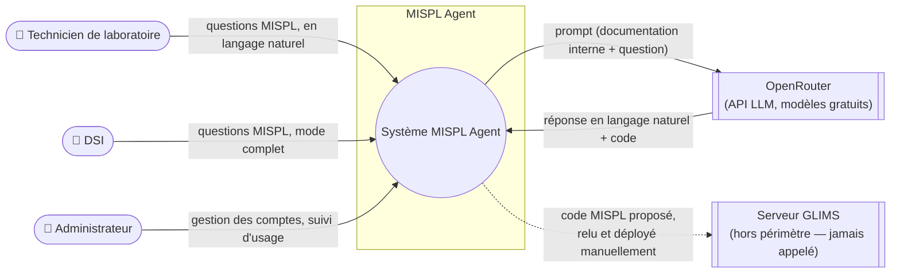
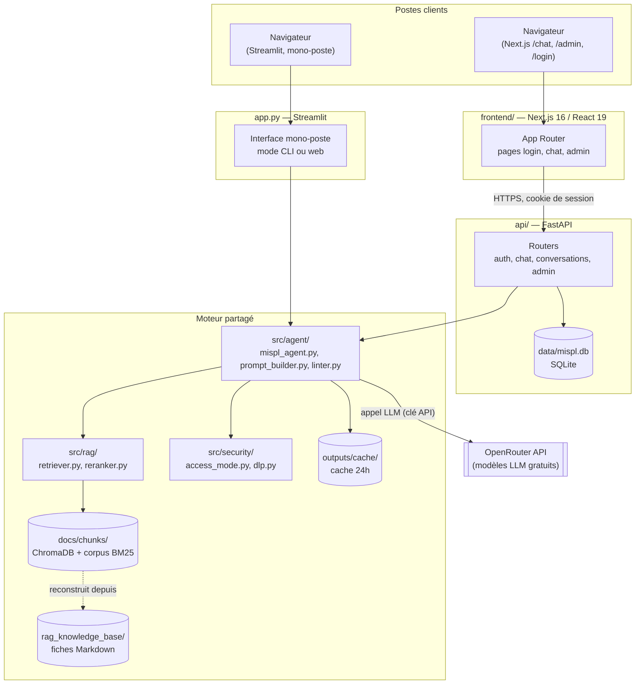
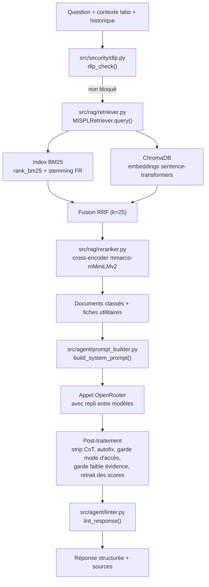
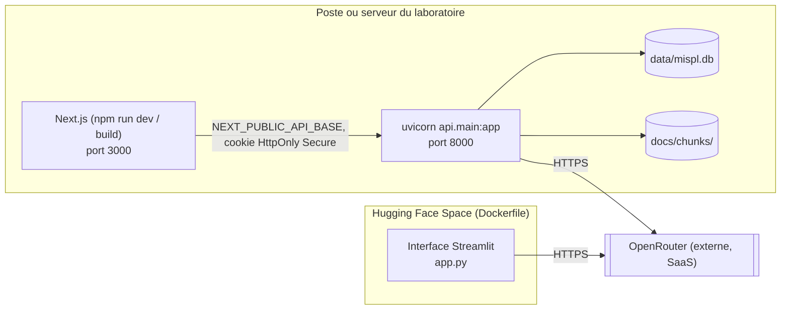

# Architecture

## Vue de contexte

MISPL Agent est utilisé par des techniciens de laboratoire et la DSI d'un
laboratoire de biologie médicale. Il s'appuie sur un fournisseur de modèles
de langage tiers (OpenRouter) et ne se connecte à aucun système du SIL GLIMS
en production : il produit du code que l'humain relit et déploie lui-même.

## Vue conteneurs

**Pourquoi deux interfaces qui partagent le même moteur** : `app.py`
(Streamlit) reste l'interface mono-poste historique, toujours en production
(lancée par `start.ps1` et par le `Dockerfile`, déploiement de type Hugging
Face Space). L'API FastAPI et le frontend Next.js couvrent un besoin
apparu ensuite : plusieurs comptes, historique de conversations, tableau de
bord d'administration. Les deux interfaces appellent la même fonction
`ask_mispl()` de `src/agent/mispl_agent.py`, pour ne jamais dupliquer la
logique de retrieval, de génération et des garde-fous de sortie (voir
`docs/architecture/adr/0006-fastapi-nextjs-en-plus-de-streamlit.md`).

## Vue composants — traitement d'une question

## Flux de données

1. **Question → DLP** : la question, le contexte labo optionnel et
   l'historique de conversation (max 6 derniers échanges) sont scannés par
   `dlp_check()` avant tout autre traitement. Rien n'atteint le retrieval ni
   le LLM si un motif bloquant est détecté.
2. **Retrieval hybride** : la question est tokenisée pour BM25 (stemming
   français NLTK, préservation des identifiants PascalCase) et encodée pour
   la recherche dense ChromaDB. Les deux classements sont fusionnés par
   Reciprocal Rank Fusion, puis le pool de candidats est réordonné par un
   cross-encoder multilingue.
3. **Construction du prompt** : le prompt système est assemblé depuis les
   skills métier (`.claude/skills/mispl-*`) actives pour la question, les
   règles globales (`.claude/rules/`), la garde anti-extraction et la
   consigne du mode d'accès (Technicien ou DSI).
4. **Appel LLM** : le prompt système, l'historique et le prompt utilisateur
   (question + contexte documentaire RAG) sont envoyés à OpenRouter. En cas
   d'erreur 429 ou d'indisponibilité, un repli automatique essaie les modèles
   suivants de `FALLBACK_ORDER`, dans la limite d'un budget de temps total.
5. **Post-traitement** : la réponse brute est nettoyée (raisonnement interne
   résiduel), corrigée automatiquement (syntaxe MISPL), passée dans la
   barrière de mode d'accès, la garde de faible évidence, le retrait des
   scores de retrieval qui auraient fuité, puis lintée.
6. **Persistance** : la question, la réponse, les sources et le résultat du
   lint sont enregistrés — en session journalisée (`outputs/sessions/`,
   Streamlit) ou en conversation SQLite (`data/mispl.db`, plateforme API),
   selon l'interface. La réponse est aussi mise en cache disque 24 h.

## Déploiement

- L'interface Streamlit se déploie telle quelle via le `Dockerfile` fourni
  (image type Hugging Face Space).
- La plateforme API + frontend s'exécute sur un poste ou serveur du
  laboratoire : `uvicorn api.main:app` pour l'API, `npm run dev` ou un build
  de production pour le frontend Next.js. Les deux processus partagent le
  même moteur Python (`src/`) via import direct (l'API l'appelle depuis le
  même environnement Python).
- **HTTPS est obligatoire en production** : le cookie de session porte
  l'attribut `Secure` par défaut (`MISPL_COOKIE_SECURE`). En HTTP simple, le
  navigateur refuse silencieusement le cookie et la connexion échoue.
- Aucune base de données n'est partagée entre l'interface Streamlit et la
  plateforme API : `data/mispl.db` (comptes, sessions, conversations,
  usage) n'existe que pour la plateforme API ; Streamlit journalise en
  fichiers JSON dans `outputs/sessions/`.

## Voir aussi

- `docs/architecture/adr/` : décisions structurantes, une par fichier
  (format MADR), avec leurs alternatives étudiées et leurs conséquences.
- `docs/architecture/chronologie.md` : chronologie datée du projet.
- `docs/architecture/journal_bugs.md` : bugs rencontrés et corrigés.
- `docs/specifications/diagramme_activite.md` : déroulé détaillé, avec les
  branches d'erreur, du traitement d'une question et de la mise à jour de la
  base de connaissances.
