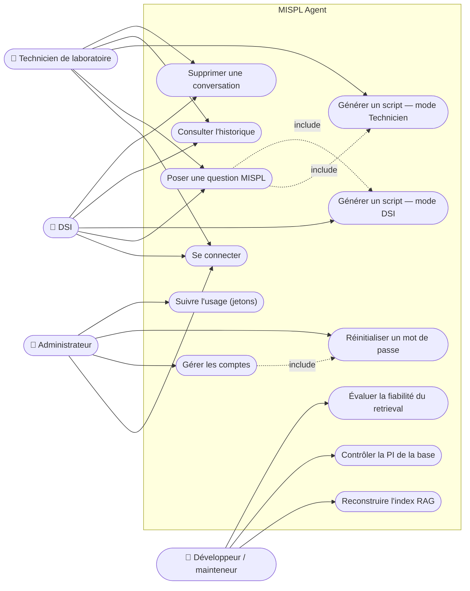

# Cas d'utilisation

## Diagramme de cas d'utilisation

Note de lecture : `UC3` (mode Technicien) et `UC4` (mode DSI) sont deux
variantes du même cas « générer un script », qui déclenchent toutes deux le
même traitement de bout en bout (voir `diagramme_activite.md`) avec une
barrière différente sur les boucles.

## Fiches de cas d'utilisation

### UC-01 — Se connecter

- **Acteur** : Technicien, DSI, Administrateur.
- **Préconditions** : un compte actif existe (créé par un administrateur, voir
  UC-07). L'utilisateur connaît son e-mail et son mot de passe (temporaire ou
  déjà changé).
- **Scénario nominal** :
  1. L'utilisateur soumet e-mail + mot de passe à `POST /auth/login`.
  2. L'API vérifie le mot de passe (Argon2id), vérifie que le compte n'est ni
     verrouillé ni désactivé.
  3. En cas de succès, l'API crée une session, pose un cookie `HttpOnly`
     (attribut `Secure` en production), valable 8 h.
  4. Le frontend redirige vers `/chat`.
- **Scénarios alternatifs** :
  - Mot de passe invalide : le compteur d'échecs du compte est incrémenté ;
    après 5 échecs, le compte est verrouillé 15 minutes. La réponse ne
    distingue pas « compte inconnu » de « mot de passe invalide » (pas de
    signal d'énumération de comptes).
  - Trop de tentatives depuis la même adresse IP : blocage temporaire,
    indépendamment du compte ciblé (protection anti *credential stuffing*).
- **Postconditions** : une session valide existe ; l'utilisateur accède aux
  pages protégées du frontend.

### UC-02 — Poser une question MISPL

- **Acteur** : Technicien, DSI.
- **Préconditions** : UC-01 réalisé (plateforme) ou application Streamlit
  lancée.
- **Scénario nominal** :
  1. L'utilisateur saisit une question en français, éventuellement avec un
     contexte labo complémentaire.
  2. La question passe le contrôle DLP, le retrieval hybride, la génération
     LLM et les garde-fous de sortie (voir `diagramme_activite.md`).
  3. La réponse structurée (`## Contexte GLIMS`, code, source, niveau de
     certitude, notes techniques) s'affiche, avec la liste des sources
     documentaires utilisées.
  4. La question et la réponse sont enregistrées dans la conversation en
     cours (plateforme) ou dans une session journalisée (Streamlit).
- **Scénarios alternatifs** :
  - Le DLP bloque la requête (donnée potentiellement identifiante) : aucun
    appel au LLM n'a lieu, un message d'alerte est renvoyé.
  - Aucune documentation pertinente trouvée : la réponse commence par
    « ⚠️ Fonction non trouvée » et propose du pseudo-code.
  - Documentation faible mais non nulle : un bandeau « Documentation faible
    détectée » est ajouté et toute affirmation « ✅ Certain » est rétrogradée
    en « 🔬 À vérifier ».
  - Tous les modèles LLM gratuits sont indisponibles : erreur 503 renvoyée
    après épuisement du budget de repli (voir
    `docs/architecture/adr/0002-openrouter-modeles-gratuits-fallback.md`).
- **Postconditions** : une réponse sourcée est renvoyée à l'utilisateur (ou
  une erreur explicite) ; la question est comptabilisée dans l'usage de
  jetons du compte.

### UC-03 — Générer un script en mode Technicien

- **Acteur** : Technicien (mode par défaut de tout compte sans droit DSI, ou
  session Streamlit sans mot de passe DSI saisi).
- **Préconditions** : UC-02 en cours ; le compte n'a pas `can_use_dsi_mode`.
- **Scénario nominal** : identique à UC-02, avec une consigne de prompt
  interdisant les boucles et une barrière post-génération
  (`enforce_access_mode`) qui remplace toute réponse contenant malgré tout
  une boucle `WHILE`/`REPEAT` par un message de refus invitant à contacter la
  DSI.
- **Scénarios alternatifs** :
  - Le besoin peut être couvert par une fonction intégrée (sans boucle) : la
    réponse normale est générée.
  - Le besoin nécessite réellement une boucle : refus explicite, sans bloc de
    code, sans bandeau « documentation faible » (exempté pour ce type de
    refus).
- **Postconditions** : le code livré au technicien ne contient jamais de
  boucle.

### UC-04 — Générer un script en mode DSI

- **Acteur** : DSI (compte avec `can_use_dsi_mode=true`, ou mode DSI
  déverrouillé par mot de passe dans Streamlit).
- **Préconditions** : UC-02 en cours ; le compte porte le droit DSI, ou le
  mot de passe DSI (haché en PBKDF2-HMAC-SHA256, stocké dans `.env`) a été
  saisi avec succès dans Streamlit.
- **Scénario nominal** : identique à UC-02, sans la restriction sur les
  boucles ; le code généré peut utiliser `WHILE`/`REPEAT` si nécessaire.
- **Scénarios alternatifs** : dans Streamlit, si aucun hash de mot de passe
  DSI n'est configuré dans `.env`, le mode DSI est définitivement
  inatteignable (fail-safe).
- **Postconditions** : le code livré peut contenir des boucles ; la DSI reste
  responsable de sa relecture avant déploiement.

### UC-05 — Consulter l'historique

- **Acteur** : Technicien, DSI.
- **Préconditions** : UC-01 réalisé ; au moins une conversation existe.
- **Scénario nominal** :
  1. `GET /conversations` liste les conversations de l'utilisateur connecté
     (regroupées par période côté frontend).
  2. `GET /conversations/{id}` renvoie le détail (messages, sources) d'une
     conversation dont l'utilisateur est propriétaire.
- **Scénarios alternatifs** : tentative d'accès à une conversation d'un autre
  utilisateur → 404 (pas de distinction avec « conversation inexistante »,
  pour ne pas révéler l'existence d'identifiants d'autrui — voir
  `api/ownership.py`).
- **Postconditions** : aucune modification de données ; lecture seule.

### UC-06 — Supprimer une conversation

- **Acteur** : Technicien, DSI.
- **Préconditions** : UC-05 ; l'utilisateur est propriétaire de la
  conversation.
- **Scénario nominal** : `DELETE /conversations/{id}` supprime la
  conversation et tous ses messages (cascade).
- **Scénarios alternatifs** : conversation d'un autre utilisateur ou
  inexistante → 404.
- **Postconditions** : la conversation n'apparaît plus dans l'historique.

### UC-07 — Gérer les comptes (administrateur)

- **Acteur** : Administrateur.
- **Préconditions** : UC-01 réalisé avec un compte `platform_role="admin"`.
- **Scénario nominal** :
  1. Créer un compte (`POST /admin/users`) : e-mail, nom, rôle, droit DSI ;
     un mot de passe temporaire est généré côté serveur et renvoyé une seule
     fois.
  2. Lister les comptes et leur usage agrégé (`GET /admin/users`).
  3. Modifier un compte (`PATCH /admin/users/{id}`) : nom, e-mail, rôle,
     droit DSI, statut actif.
- **Scénarios alternatifs** :
  - E-mail déjà utilisé : conflit 409 explicite.
  - Tentative de désactiver ou rétrograder le dernier administrateur actif :
    refusée par un garde-fou dédié (`_count_active_admins`).
- **Postconditions** : le compte est créé/modifié ; en cas de désactivation,
  l'utilisateur ne peut plus se connecter mais ses conversations passées
  restent en base.

### UC-08 — Réinitialiser un mot de passe

- **Acteur** : Administrateur.
- **Préconditions** : UC-07 ; le compte cible existe.
- **Scénario nominal** : `POST /admin/users/{id}/reset-password` génère un
  nouveau mot de passe temporaire, le hache (Argon2id) et le renvoie une
  seule fois à l'administrateur, à charge pour lui de le transmettre à
  l'utilisateur par un canal sécurisé.
- **Scénarios alternatifs** : combiné en pratique avec UC-13 (révocation des
  sessions) pour couper immédiatement l'accès avec l'ancien mot de passe.
- **Postconditions** : l'ancien mot de passe ne fonctionne plus.

### UC-09 — Suivre l'usage

- **Acteur** : Administrateur.
- **Préconditions** : UC-01 réalisé (administrateur).
- **Scénario nominal** : `GET /admin/users` renvoie, par compte, un usage
  agrégé sur une fenêtre glissante ; `GET
  /admin/users/{id}/usage-daily` renvoie le détail jour par jour
  (`UsageDaily` : jetons de prompt, jetons de complétion, nombre de
  requêtes). Le frontend affiche un graphique de consommation avec
  sélection de période.
- **Postconditions** : lecture seule ; aide à détecter un usage anormal ou
  à anticiper les limites de débit des modèles gratuits.

### UC-10 — Reconstruire l'index

- **Acteur** : Développeur / mainteneur.
- **Préconditions** : la base `rag_knowledge_base/` a été modifiée (nouvelle
  fiche, correction) et a passé le contrôle PI (UC-11).
- **Scénario nominal** : `python src/rag/build_vectorstore.py` régénère
  `docs/chunks/` (vectorstore ChromaDB, corpus BM25, manifeste). L'option
  `--dry-run` affiche les statistiques sans écrire.
- **Scénarios alternatifs** : reconstruction partielle ou erreur de
  frontmatter YAML dans une fiche → le script échoue explicitement plutôt que
  de produire un index partiel silencieux.
- **Postconditions** : l'index reflète la base actuelle ; le cache de
  réponses n'est pas invalidé automatiquement par cette étape seule (il faut
  vider `outputs/cache/` si des réponses obsolètes doivent disparaître avant
  leur expiration à 24 h).

### UC-11 — Contrôler la PI de la base

- **Acteur** : Développeur / mainteneur.
- **Préconditions** : le manuel GLIMS est disponible localement (jamais
  versionné) ; une modification de `rag_knowledge_base/` est envisagée ou
  vient d'être faite.
- **Scénario nominal** : `python tools/check_ip_similarity.py --manual
  "<chemin local>"` compare la base au manuel (n-grammes, TF-IDF, et en
  option embeddings e5) ; le script sort avec le code 0 et « RÉSULTAT : OK »
  si aucun risque ÉLEVÉ ni MOYEN n'est détecté.
- **Scénarios alternatifs** : un risque est détecté → la fiche concernée doit
  être réécrite avant tout commit, ou une exception justifiée est ajoutée à
  `tools/ip_allowlist.json`.
- **Postconditions** : la base peut être versionnée et l'index reconstruit
  (UC-10) en confiance sur l'absence de reprise du manuel.

### UC-12 — Évaluer la fiabilité (retrieval)

- **Acteur** : Développeur / mainteneur.
- **Préconditions** : l'index a été reconstruit (UC-10).
- **Scénario nominal** : `python scripts/eval_retrieval_kb.py` mesure
  hit@1/hit@3/hit@5 et le MRR sur deux volets — exact-match (toutes les
  fonctions connues, interrogées par leur nom) et sémantique (50 questions en
  français sans nom de fonction) — et écrit le détail dans
  `outputs/eval_retrieval_kb.json`.
- **Scénarios alternatifs** : `--semantic-only` limite l'évaluation au volet
  sémantique ; `--out` change le fichier de sortie.
- **Postconditions** : les chiffres obtenus sont comparés à la référence
  documentée dans `CLAUDE.md`/`README.md` ; toute dégradation sans
  justification doit être investiguée avant fusion.
