# Diagrammes d'activité

## Traitement d'une question MISPL, de bout en bout

Ce diagramme reflète le traitement réel implémenté par `ask_mispl()`
(`src/agent/mispl_agent.py`) et les routes `POST /auth/login` /
`POST /chat/ask` (`api/routers/auth.py`, `api/routers/chat.py`), plus le DLP
(`src/security/dlp.py`) et la barrière de mode d'accès
(`src/security/access_mode.py`).

```mermaid
flowchart TD
    Start([Utilisateur soumet une question]) --> Auth{Session valide ?}
    Auth -- non --> Err401[401 — redirection connexion]
    Auth -- oui --> RateLimit{Sous la limite de débit ?<br/>20 req/min/utilisateur}
    RateLimit -- non --> Err429[429 — Trop de requêtes]
    RateLimit -- oui --> DLP{Contrôle DLP<br/>question + contexte labo + historique}
    DLP -- motif bloquant<br/>ou combinaison identifiante --> BlockDLP[Requête bloquée<br/>aucun appel LLM]
    DLP -- motif non bloquant --> WarnDLP[Alerte DLP non bloquante<br/>journalisée]
    DLP -- aucun motif --> Cache
    WarnDLP --> Cache{Réponse en cache ?<br/>clé = CACHE_VERSION + RETRIEVAL_PIPELINE_VERSION<br/>+ question + modèle + skills + mode + historique}
    Cache -- oui, âge < 24h --> Served[Réponse servie depuis le cache]
    Cache -- non --> Skills[Détection du profil de skills<br/>code / report / erd / perf]
    Skills --> Retrieval[Retrieval hybride<br/>BM25 + dense ChromaDB → RRF k=25<br/>puis reranking cross-encoder]
    Retrieval --> Helper[Ajout des fiches utilitaires<br/>formatage décimal, date/heure, valeur inconnue]
    Helper --> Prompt[Construction du prompt système<br/>+ prompt utilisateur avec contexte RAG]
    Prompt --> LLM[Appel LLM OpenRouter]
    LLM --> LLMOk{Succès ?}
    LLMOk -- 429 / erreur --> Fallback{Modèle de repli disponible<br/>et budget de temps restant ?}
    Fallback -- oui --> LLM
    Fallback -- non --> Err503[503 — Tous les modèles indisponibles]
    LLMOk -- oui --> StripCoT[Retrait du raisonnement interne<br/>chain-of-thought résiduel]
    StripCoT --> Autofix[Auto-corrections MISPL<br/>// → /* */, CascadeRequest → AddRequest...]
    Autofix --> ModeGuard{Mode Technicien<br/>et boucle WHILE/REPEAT détectée ?}
    ModeGuard -- oui --> Refusal[Réponse remplacée par<br/>le refus mode DSI]
    ModeGuard -- non --> WeakEvidence{Meilleur score de retrieval<br/>< 0.50 ?}
    WeakEvidence -- oui --> Downgrade[Bandeau documentation faible<br/>+ rétrogradation Certain → À vérifier]
    WeakEvidence -- non --> StripScores
    Downgrade --> StripScores[Retrait des scores de retrieval<br/>qui auraient fuité dans le texte]
    Refusal --> StripScores
    StripScores --> Lint[Lint MISPL du code généré<br/>boucles infinies, division par zéro,<br/>champs lecture seule, fonctions inventées]
    Lint --> LintClean{Code propre ?}
    LintClean -- non --> Annotate[Ajout du rapport de lint<br/>à la réponse]
    LintClean -- oui --> Save
    Annotate --> Save[Sauvegarde session/conversation<br/>+ mise en cache 24h]
    Save --> Response([Réponse structurée renvoyée<br/>+ sources + certitude])
    Served --> Response
    BlockDLP --> ResponseBlocked([Alerte renvoyée à l'utilisateur])
```



### Points de décision notables

- **DLP avant tout appel LLM** : aucune donnée n'atteint le LLM tiers
  (OpenRouter) si le DLP bloque — c'est la seule étape qui peut interrompre
  le traitement sans jamais avoir contacté un service externe.
- **Cache versionné** : la clé de cache inclut `CACHE_VERSION` et
  `RETRIEVAL_PIPELINE_VERSION`, si bien qu'une modification du comportement
  de génération ou du retrieval invalide automatiquement les entrées
  obsolètes sans purge manuelle nécessaire (voir `mispl_agent.py::_cache_key`).
- **Repli LLM borné dans le temps** : le repli entre modèles gratuits
  (`_call_with_fallback`) est plafonné à 60 secondes au total (tous modèles et
  tentatives confondus), pour ne jamais bloquer un worker FastAPI de façon
  disproportionnée sous charge.
- **Garde de mode d'accès après génération** : la restriction du mode
  Technicien n'est pas qu'une consigne de prompt — une barrière mécanique
  (`enforce_access_mode`) inspecte la réponse générée et la remplace
  entièrement par un refus si une boucle est présente, y compris hors bloc de
  code correctement balisé.
- **Garde de faible évidence indépendante du LLM** : le seuil de score
  (0,50) est appliqué en code après génération, pas seulement demandé au LLM
  par consigne de prompt — un audit du 2026-08-27 a montré des cas où le LLM
  affirmait « ✅ Certain » malgré des scores de retrieval tous inférieurs à
  0,17.
- **Retrait des scores avant mise en cache** : le nettoyage des scores de
  retrieval qui auraient fuité dans le texte visible a lieu avant la sauvegarde
  en cache, pour qu'une réponse servie plus tard depuis le cache soit aussi
  propre qu'une réponse fraîchement générée.

## Mise à jour de la base de connaissances

Ce diagramme reflète la procédure documentée dans `CLAUDE.md` (section
« Propriété intellectuelle de la base de connaissances ») et les scripts
`tools/check_ip_similarity.py`, `src/rag/build_vectorstore.py`,
`scripts/eval_retrieval_kb.py`.

```mermaid
flowchart TD
    Start([Besoin d'ajouter ou modifier<br/>une fiche de rag_knowledge_base/]) --> Facts[Relever uniquement des faits techniques<br/>signature, paramètres, retour, comportement<br/>rédigés avec des mots propres au projet]
    Facts --> NoExample{Un exemple du manuel<br/>a-t-il été recopié ?}
    NoExample -- oui --> Rewrite[Remplacer par un exemple original<br/>créé pour le projet ou issu d'un script labo]
    Rewrite --> Facts
    NoExample -- non --> IPCheck[Lancer tools/check_ip_similarity.py<br/>--manual chemin local du manuel]
    IPCheck --> IPResult{RÉSULTAT : OK ?<br/>aucun signalement ÉLEVÉ ni MOYEN}
    IPResult -- non --> Fix{Signalement légitime<br/>ou faux positif documenté ?}
    Fix -- reprise réelle --> Facts
    Fix -- faux positif justifié --> Allowlist[Ajouter une exception motivée<br/>dans tools/ip_allowlist.json]
    Allowlist --> IPCheck
    IPResult -- oui --> Sources[Mettre à jour rag_knowledge_base/SOURCES.md<br/>si une nouvelle source est utilisée]
    Sources --> Rebuild[Reconstruire l'index<br/>python src/rag/build_vectorstore.py]
    Rebuild --> Tests[Relancer pytest]
    Tests --> TestsOk{Suite verte ?}
    TestsOk -- non --> Facts
    TestsOk -- oui --> Eval[Relancer scripts/eval_retrieval_kb.py<br/>exact-match + 50 requêtes sémantiques]
    Eval --> EvalOk{hit@1/hit@3/hit@5/MRR<br/>au moins égaux à la référence documentée ?}
    EvalOk -- non, sans justification --> Facts
    EvalOk -- oui, ou dégradation justifiée --> Cache[Vider outputs/cache/ si des réponses<br/>obsolètes doivent disparaître avant 24h]
    Cache --> Done([Base prête à être versionnée])
```

### Points de décision notables

- **Le contrôle PI est un préalable, pas une vérification a posteriori** :
  aucune fiche n'est censée être versionnée avant d'avoir obtenu
  `RÉSULTAT : OK` (code de sortie 0) de `check_ip_similarity.py`.
- **Les exceptions à l'allowlist doivent être motivées par écrit** :
  `tools/ip_allowlist.json` n'est pas un moyen de désactiver silencieusement
  le contrôle, mais un registre de décisions justifiées (fichier, fragment,
  justification).
- **La reconstruction de l'index ne suffit pas** : elle doit être suivie de
  la suite de tests et de l'évaluation du retrieval, car un changement de
  contenu peut faire régresser la pertinence des résultats même si le
  contrôle PI est positif.
- **Le cache n'est pas invalidé par la reconstruction de l'index** : une
  réponse mise en cache avant la modification de la base peut rester servie
  jusqu'à 24 h après ; il faut vider `outputs/cache/` si cela pose un
  problème pour la validation en cours.
