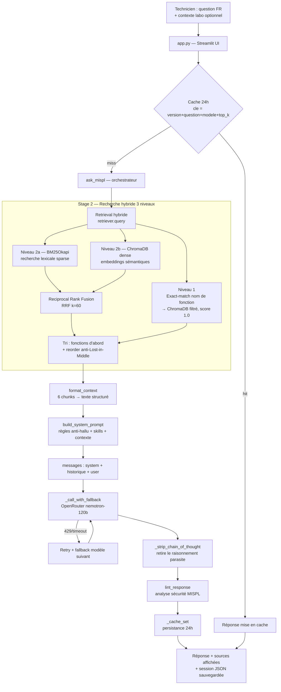

# 1 — Vue d'ensemble de l'architecture

## Résumé exécutif

**MISPL Agent** est un assistant conversationnel (chatbot) spécialisé dans le langage de script **MISPL** du SIL (Système d'Information de Laboratoire) **GLIMS** de Clinisys. Il aide les techniciens de laboratoire de biologie médicale à écrire, comprendre et déboguer du code MISPL.

### Périmètre
- **Entrée** : questions en langage naturel (français) ou noms de fonctions MISPL.
- **Sortie** : réponses structurées (contexte clinique → code MISPL → sources documentaires → niveau de certitude), chaque affirmation étant tracée vers un fichier de documentation GLIMS officiel (`.htm`).
- **Garantie clé** : **zéro hallucination** — le modèle ne doit utiliser que des fonctions présentes dans la documentation récupérée. Toute fonction absente est signalée comme « à vérifier dans GLIMS » avec du pseudo-code.

### Ce que l'agent N'EST PAS
- Pas un exécuteur de code MISPL (il génère, il n'exécute pas).
- Pas connecté à une instance GLIMS live (il travaille sur une documentation indexée hors-ligne).

---

## Flux de données (Data Flow)

Trajet complet d'une requête utilisateur, de l'input à la réponse affichée :



### Étapes détaillées

1. **Input** — `app.py` capture la question via `st.chat_input`. Un champ « Contexte labo » optionnel (analyseur, tube, unités) préfixe la question si renseigné (`question_enriched`).
2. **Cache** — `ask_mispl` calcule une clé SHA-256 `(CACHE_VERSION, question, model, top_k)`. Si une réponse de moins de 24h existe, elle est resservie sans appel LLM.
3. **Retrieval hybride** (cœur, voir fichier 3) — trois niveaux : exact-match, BM25 (lexical), dense (sémantique), fusionnés par RRF.
4. **Assemblage du prompt** — `build_system_prompt` combine les règles anti-hallucination, les Skills Markdown actifs, et le contexte récupéré.
5. **Génération LLM** — appel OpenRouter avec retry sur rate-limit et fallback automatique sur d'autres modèles gratuits, timeout 45 s.
6. **Post-traitement** — strip du chain-of-thought, lint de sécurité du code MISPL généré, mise en cache.
7. **Affichage** — réponse + sources documentaires citées, échange sauvegardé en JSON.

---

## Arborescence

```
MISPL/
├── app.py                          # Point d'entrée — UI Streamlit (thème dark, chat, paramètres)
├── requirements.txt                # Dépendances Python
├── start.ps1                       # Script de lancement Windows
├── setup.py                        # Packaging
│
├── src/
│   ├── agent/
│   │   ├── mispl_agent.py          # ORCHESTRATEUR — ask_mispl(), cache, fallback LLM, strip CoT
│   │   ├── prompt_builder.py       # Assemblage du system prompt + injection des Skills
│   │   └── linter.py               # Linter de sécurité du code MISPL généré
│   │
│   └── rag/
│       ├── build_vectorstore.py    # INGESTION — parse HTML GLIMS → chunks → ChromaDB + BM25
│       └── retriever.py            # RECHERCHE — hybride BM25 + dense + RRF + reorder
│
├── docs/
│   └── chunks/
│       ├── vectorstore/            # Base ChromaDB persistée (embeddings denses)
│       ├── bm25_corpus.json        # Corpus texte pour BM25 + liste des fonctions connues
│       └── manifest.json           # Métadonnées du build (nb chunks, modèle, etc.)
│
├── french/Content/                 # Documentation GLIMS source (.htm) — matière première
│
├── .claude/
│   ├── skills/                     # SKILL.md par domaine (mispl-core, reports, erd, performance)
│   └── rules/                      # Règles globales injectées dans le prompt
│
├── outputs/
│   ├── sessions/                   # Historique JSON de chaque échange (audit)
│   └── cache/                      # Réponses mises en cache 24h
│
└── scripts/                        # Utilitaires de test et de diagnostic
```

### Rôle de chaque script clé

| Script | Rôle |
|---|---|
| `app.py` | Interface web Streamlit. Aucune logique métier — orchestration UI uniquement. |
| `src/agent/mispl_agent.py` | Chef d'orchestre : cache → retrieval → prompt → LLM → lint. |
| `src/agent/prompt_builder.py` | Construit le prompt système, charge les Skills (avec cache et whitelist anti-traversal). |
| `src/agent/linter.py` | Analyse statique du code MISPL généré (boucles infinies, division entière, champs read-only). |
| `src/rag/build_vectorstore.py` | Pipeline d'ingestion (hors-ligne) : HTML → chunks → ChromaDB + corpus BM25. |
| `src/rag/retriever.py` | Recherche hybride en ligne : exact-match + BM25 + dense + RRF + reorder. |
